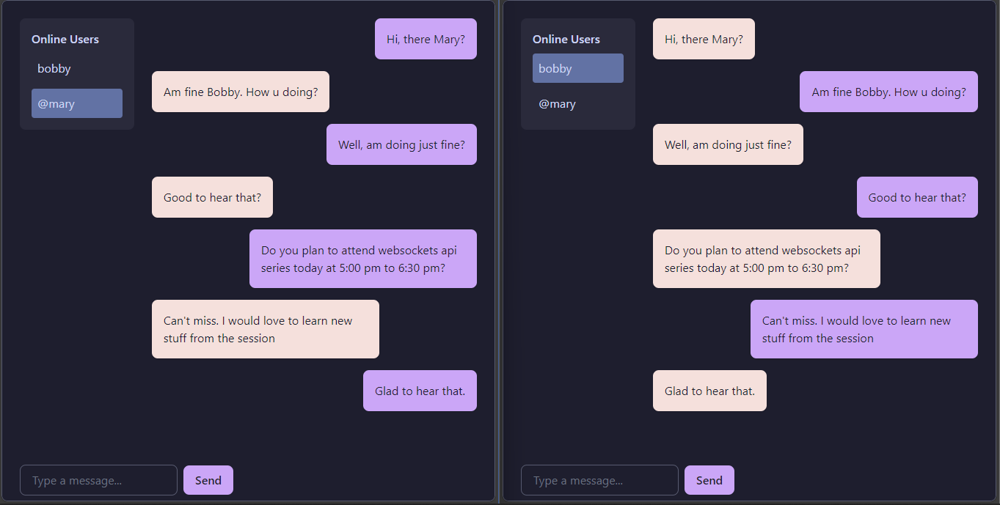

# Simple WebSocket Chat App with Private Messaging

This is a WebSocket-based chat application for the websockets API series that allows users to join a chat room and send private messages to each other. Built with `Socket.IO`, this app supports real-time messaging and user presence tracking.

## Features.

- **Real-time Messaging**: Users can send and receive messages instantly.
- **Private Messaging**: Users can send messages directly to specific online users.
- **User Presence Tracking**: Displays the list of currently connected users and updates in real-time as users join or leave.

## Getting Started.

### Prerequisites.

- **Node.js** (v14 or later)
- **npm** (Node Package Manager)
- **mongodb** (You can use MongoDB Atlas or locally installed)

### Examples



### Installation

1. Clone the repository by pasting this command in terminal then press enter:
   ```bash
   git clone https://github.com/bob-hawkins/simple-chat-app.git
   cd simple-chat-app
   ```
2. Run this command to navigate to the root directory of the cloned repo:

```bash
cd simple-chat-app
```

3. Create a `.env` file:
   ```bash
   touch .env
   ```
4. Open the `.env` file and add your mongodb database url:
   ```bash
   MONGODB_URL=<enter your mongodb database url(Can be local or via the cloud- MongoDB Atlas)>
   ```
5. Install the dependencies

```bash
npm install
```

6. Run the command below to start the server and open your browser at `http://localhost:4000/`

```bash
npm start
``` 
